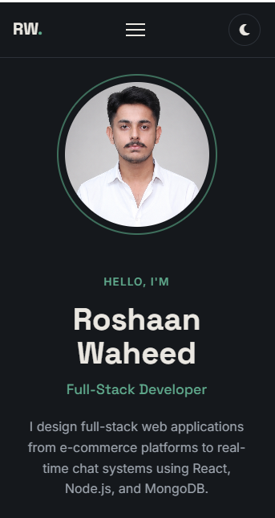
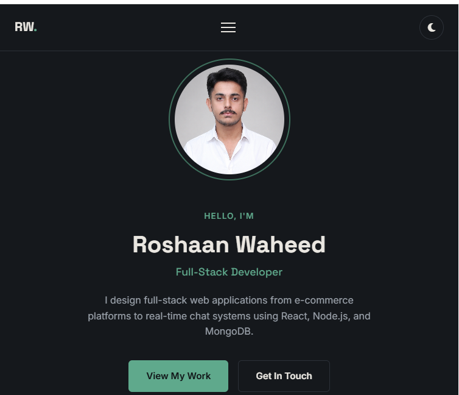
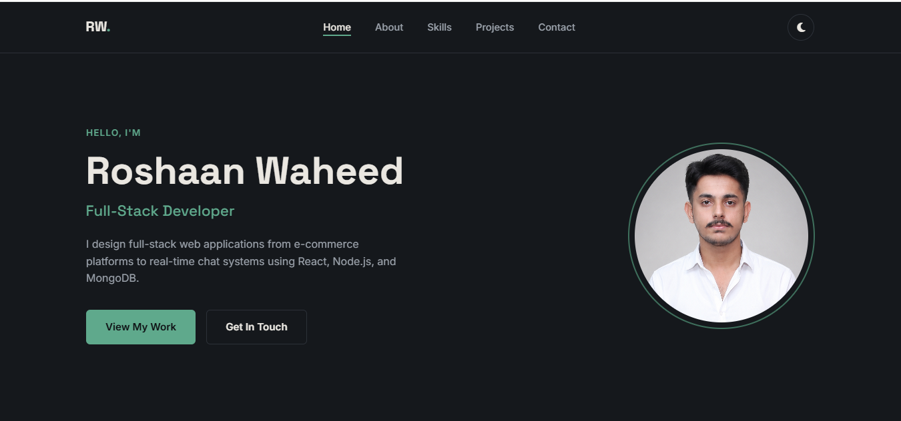

# Roshaan Waheed | Personal Portfolio Website

A fully responsive, single-page personal portfolio website built with vanilla HTML, CSS, and JavaScript — no frameworks, no page builders. Built as Project 01 (Beginner Level) for The Sky Gen's Web Development program.

**Live site:** https://tsg-webdev-p01-roshaanwaheed.vercel.app/
**Repository:** https://github.com/RoshaanWaheed/TSG-webdev-P01-roshaanwaheed

---

## Description

This is a single-page portfolio site that presents me as a full-stack developer to potential clients and employers. It includes a hero introduction, an about section, a skills breakdown, a showcase of three real projects, and a working contact form — all built from scratch without any drag-and-drop tools or CSS frameworks.

## Features

- **Responsive navigation** — fixed header with smooth-scroll links, collapses into a mobile hamburger menu below 768px
- **Hero section** — name, tagline, short intro, profile photo, and call-to-action buttons
- **About section** — short bio with a downloadable CV/resume button
- **Skills section** — six skills displayed with icons and animated progress bars that fill in as you scroll to them
- **Projects section** — a grid of three real projects (Shoperia, OutDo, LashChat) with images, descriptions, and links
- **Contact form** — client-side JavaScript validation for name, email format, and message length, with inline error messages and a success confirmation
- **Dark/light mode toggle** — theme preference is saved and persists across visits using localStorage
- **Scroll-reveal animations** — sections and cards fade/stagger into view using the Intersection Observer API
- **Scroll-to-top button** — appears after scrolling down, smoothly returns to the top
- **Fully responsive** — tested and working cleanly at 360px, 768px, and 1440px+ with no horizontal scrolling
- **Accessibility touch** — respects `prefers-reduced-motion` for users who've disabled motion at the OS level

## Tech Stack

- **HTML5** — semantic structure
- **CSS3** — Flexbox (navbar, hero, forms), CSS Grid (skills, projects), custom properties for theming, keyframe animations, media queries
- **JavaScript (ES6)** — DOM manipulation, Intersection Observer API, localStorage, form validation, event listeners
- **Google Fonts** — Space Grotesk (headings), Inter (body text)
- **Font Awesome** — icons throughout
- **Git & GitHub** — version control
- **Vercel** — deployment

## Screenshots

| Mobile (360px) | Tablet (768px) | Desktop (1440px) |
|---|---|---|
|  |  |  |

## Demo Video


## Setup / Running Locally

1. Clone the repository:
   ```bash
   git clone https://github.com/RoshaanWaheed/Tsg-webdev-p01-roshaanwaheed.git
   ```
2. Navigate into the folder:
   ```bash
   cd tsg-webdev-p01-roshaanwaheed
   ```
3. Open `index.html` directly in your browser, or serve it locally with a tool like the VS Code Live Server extension.

No build step, no dependencies to install — it's plain HTML/CSS/JS.

## Credits

- Icons by [Font Awesome](https://fontawesome.com)
- Fonts by [Google Fonts](https://fonts.google.com) (Space Grotesk, Inter)
- All project screenshots and content are my own work

## Author

**Roshaan Waheed**
- GitHub: [@RoshaanWaheed](https://github.com/RoshaanWaheed)
- LinkedIn: [roshaan-waheed](https://www.linkedin.com/in/roshaan-waheed)
- Portfolio: [roshaanwaheed.vercel.app](https://tsg-webdev-p01-roshaanwaheed.vercel.app/)